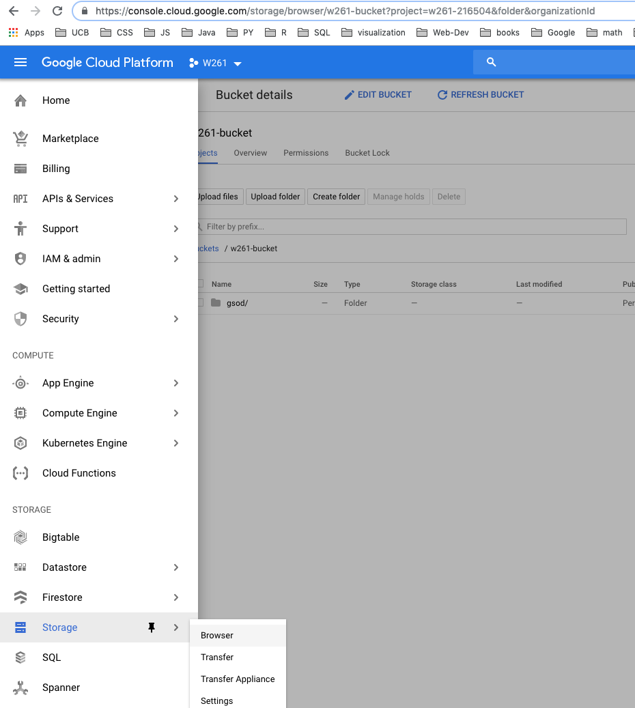
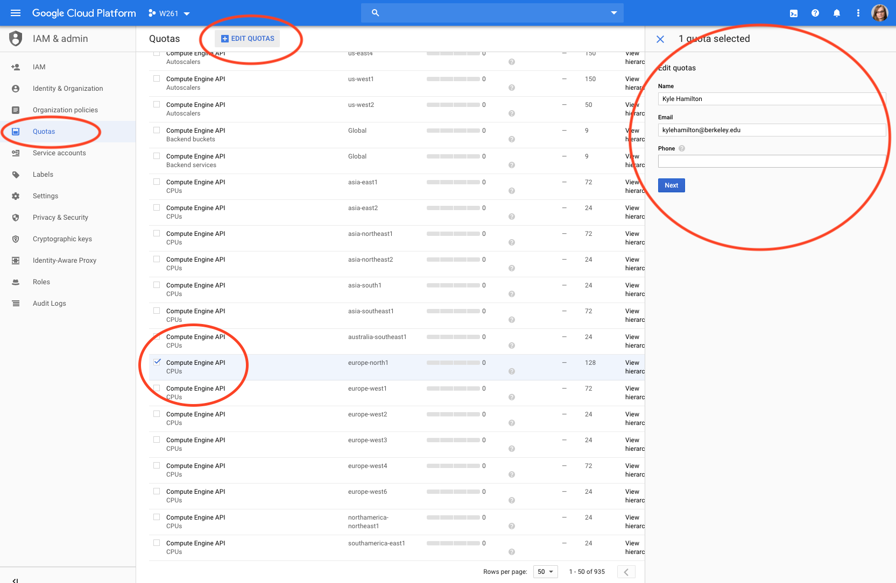
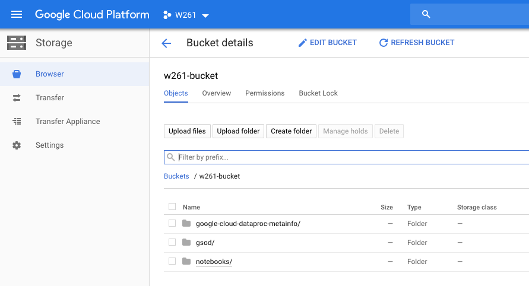

# HOW TO RUN THE WEEK 8 NOTEBOOK IN GCP
### IMPORTANT: These instructions are mainly for MacOS. You will need to make adjustments on Windows and Linux
### IMPORTANT: To save money, you may want to use the "submit" method for the HW assignemts instead of running the notebook in the cloud

## Step 1
### Claim your GCP credits


>The URL you will need to access in order to request a Google Cloud Platform coupon will be posted in Slack as soon as it becomes available. Each semester we have to request credits from Google anew, and there is no faster way to do this. Please be patient.

>You will be asked to provide your school email address and name. An email will be sent to you to confirm these details before a coupon is sent to you.

>Students' email domain(s): @ischool.berkeley.edu
>Student Coupon Retrieval Link: __TBD__
>Number of Coupons: 90
>Face Value of Coupon(s): USD __TBD__

>You will be asked for a name and email address, which needs to match the domain. 
A confirmation email will be sent to you with a coupon code.
You can request a coupon from the URL and redeem it until: __Date TBD__
Coupon valid through: __Date TBD__

>You can only request ONE code per unique email address.

## Step 2
### Create a new project
- open an incognito chrome browser window. Otherwise, google cloud bounces you around your various accounts and you could end up applying your credits in the wrong account.
- go to google cloud platform
- create a new project
- enable billing for this project

### Create a new bucket
This is where you will store your data



- give your bucket a unique name
- create a directory in your bucket called gsod (you could name it whatever you want, but the demo notebook uses this name, so it's convenient)

## Step 3
### Download the gcloud SDK
- Follow the instructions in the quickstart. This is the macos link, but you can find your OS in the left nav bar.
https://cloud.google.com/sdk/docs/quickstart-macos

- __When you are asked to authenticate, make sure you select the same google account that your credits are in.__   
- You will also be asked for a zone. Pick whatever is closest to you, and remember to always use this zone going forward.

### Add gcloud to your path.
- In your `.bash_profile` file add:   
`export PATH=/path/to/google-cloud-sdk/bin:$PATH` <- you will need to modify this to where you saved your SDK
- Either open a new terminal or enter:   
`source ~/.bash_profile`   
- Now you can use the gcloud commands from anywhere on your computer   

## Step 4
### Start your cluster:

- edit the GCP-create-cluster.sh file by editing the project and bucket names


`BUCKET="w261-bucket"` <- change to your bucket name   
`CLUSTER="w261-demo"` <- whatever you want. this will be created when creating the cluster. This will be part of your URL to the jupyter notebook.   
`PROJECT="w261-216504"` <- change to your project id   
`JUPYTER_PORT="8123"`   
`PORT="10000"`   
`ZONE=$(gcloud config get-value compute/zone)`   

- on your local computer in a terminal, run this file. It will take a few minutes.

`. GCP-create-cluster.sh`   

- You might get an error like this:
`ERROR: (gcloud.dataproc.clusters.create) INVALID_ARGUMENT: Insufficient 'CPUS' quota. Requested 56.0, available 24.0.`
- Depending on your zone, the default quotas are different. Go to the quotas page and request more quota



- Go to IAM & Admin, and click quotas
- Scroll down and select the Compute Engine API CPUs in your zone, and click the EDIT QUOTAS button at the top of the page. 
- A form will appear on the right. Follow the directions and submit. 
- You will get a message that this may take 2 business days. It probably won't. You will most likely get another email within a few minutes that your request was granted.

- When your script runs successfully, you will see output like this:

```
macbook-pro-4:w261 $ . GCP-create-cluster.sh
Waiting on operation [projects/w261-216504/regions/global/operations/1e058009-f047-3123-b6c9-470cceb9d556].
Waiting for cluster creation operation...⠼
WARNING: For PD-Standard, we strongly recommend provisioning 1TB or larger to ensure consistently high I/O performance. See https://cloud.google.com/compute/docs/disks/performance for information on disk I/O performance.
Waiting for cluster creation operation...done.
Created [https://dataproc.googleapis.com/v1/projects/w261-216504/regions/global/clusters/w261-demo] Cluster placed in zone [europe-north1-a].
Updating project ssh metadata...⠛Updated [https://www.googleapis.com/compute/v1/projects/w261-216504].
Updating project ssh metadata...done.
Waiting for SSH key to propagate.
Warning: Permanently added 'compute.8580260687166581787' (ECDSA) to the list of known hosts.
```

- edit the GCP-create-proxy.sh file by editing the project and bucket names as before
- run:
`. GCP-create-proxy.sh`   

This process will not exit. Your result should look something like this:
```
macbook-pro-4:w261 $ . GCP-create-proxy.sh
Warning: Permanently added 'compute.4173779946920154013' (ECDSA) to the list of known hosts.
```

- edit the GCP-use-proxy.sh file by editing the project and bucket names as before
- open a new terminal window (this is necessary because our create-proxy process is running in the current window) and run:
`. GCP-use-proxy.sh`

- If you are not using a macos you will need to modify the google chrome executable location. More info can be found here: https://cloud.google.com/solutions/connecting-securely#socks-proxy-over-ssh

### Access your notebook on the cluster
- A new chrome browser window will be launched. Paste your cluster address and port into the url bar. It will look something like:
`http://w261hw5kh-m:8123` (`http://<your-cluster-name>-m:8123`)
- create a new notebook using the pySpark kernel (as opposed to python3)

### Upload existing notebooks and files
- If you create a new notebook (per above), google will kindly put a notebooks folder in your bucket - one stuffed unicorn for google!
- You can upload notebooks to your bucket to your heart's content. Even when you delete your cluster, your notebooks will be preserved because they live in your bucket.



## Step 5
### Delete your cluster!
In order to avoid unnecessary charges, remember to delete your cluster when you're done:   
`gcloud dataproc clusters delete ${CLUSTER}`